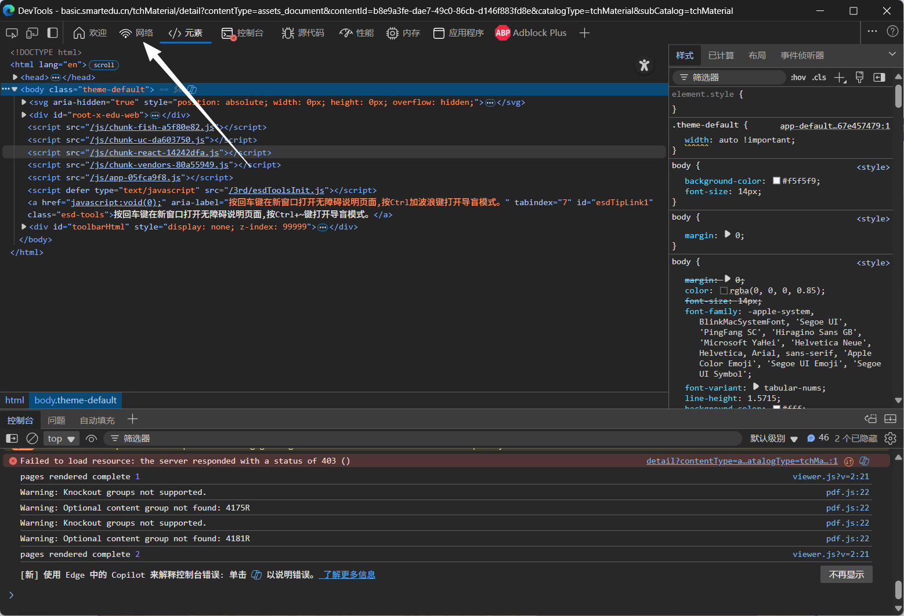
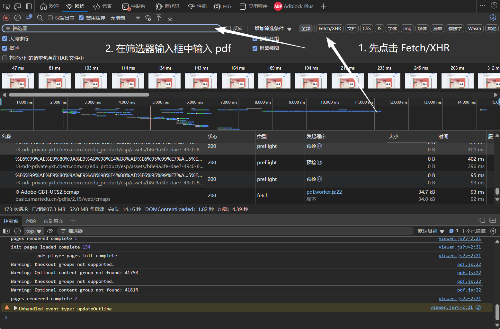
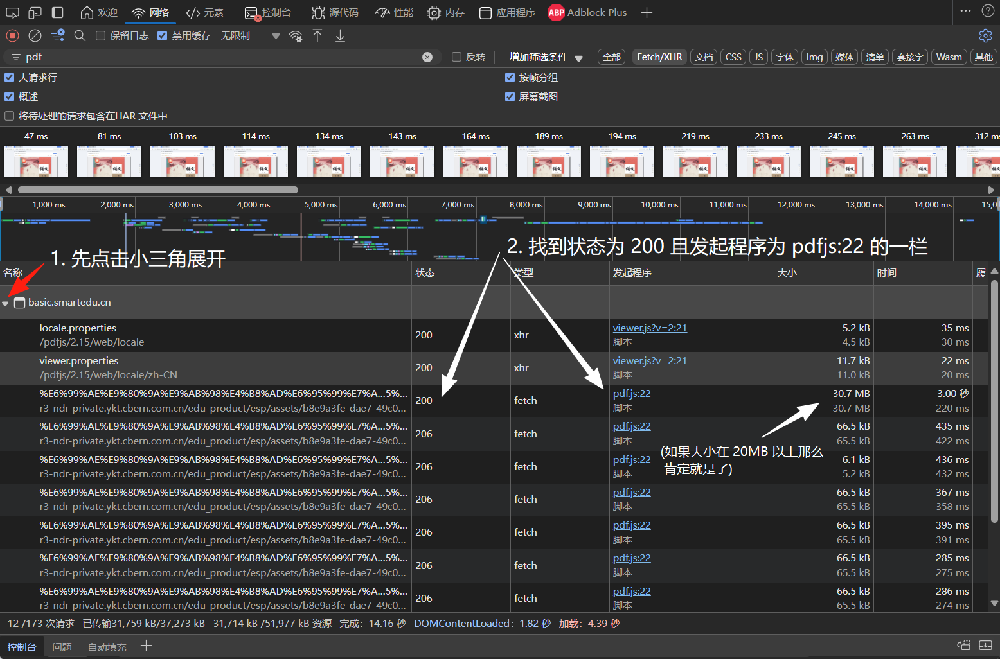
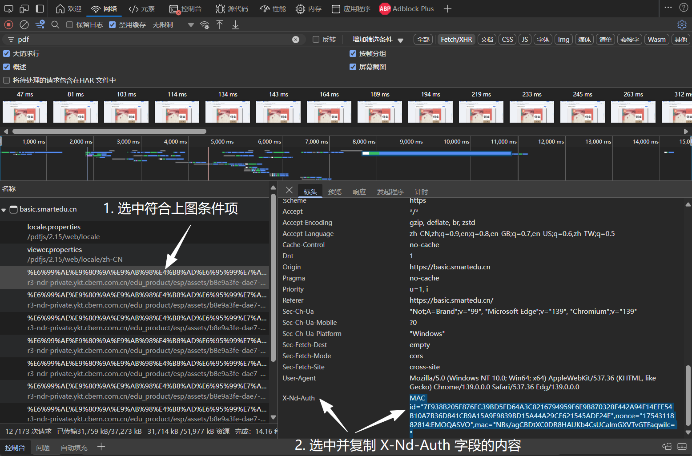
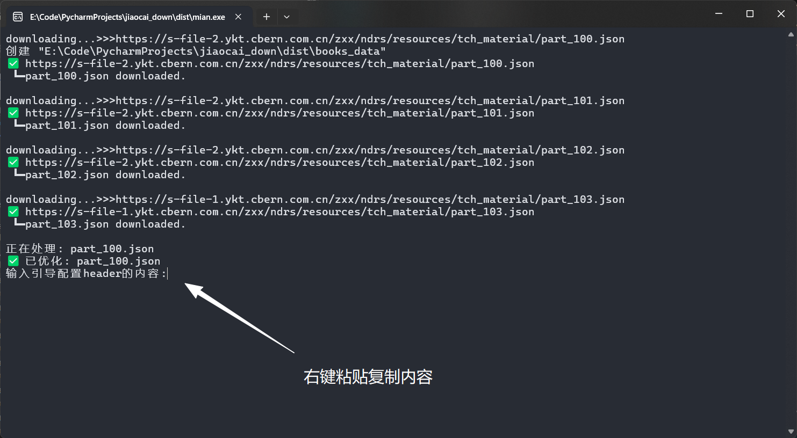

# 1. 设置header

访问 `https://basic.smartedu.cn/tchMaterial` 并登录，进入教材页面，随便选取一本教材，进入教材页面。

按下`F12`，在弹出的开发人员工具栏中，选择`网络`（如图）

按下`Ctrl`+`R`键，刷新页面，待页面刷新完毕，先点击 `Fetch/XHR` ，再在筛选器栏中输入 `pdf` （如图）

先点击小三角展开，找到状态为 `200` 且发起程序为 `pdfjs:22` 的一项（如图）并选中

选中符合上图条件项，选中并复制 `X-Nd-Auth` 字段的所有内容

在程序中粘贴
